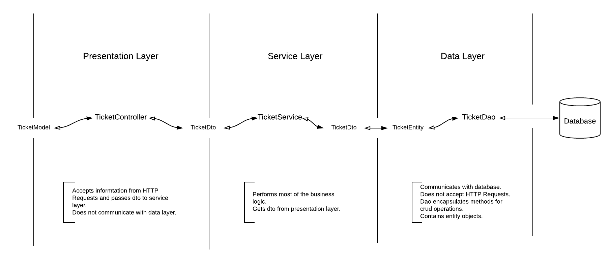

# Future Gadget Laboratories presents:
## The Parking Lot 

Future Gadget Laboratories are designing a new parking lot system for all parking lot systems within Japan. This will allow the company to track the revenue generated and also give a little bit of insight into future opportunities within the parking industry.

### Running the Application through:
## Maven

Build the project.

```
mvn clean install
```

Start the embedded Tomcat server.

```
mvn tomcat7:run
```

Navigate to 
```
localhost:8080/tickets
```


Currently has test data for the following 3 days.

- November 12   -   11/12
- November 13   -   11/13
- November 14   -   11/14

Default pricing scheme
```
Time	 |   Fee
---------+-----
0-30min	 |   R10
30-60min |   R20
1hr-2hr	 |   R30
2hr-4hr	 |   R50
LOST	 |   R100
```
Architecture of the application



## Usage
### Revenue generated for the month.

**Definition**

`GET /reports/<month>`

**Response**

- `404 Not Found` if the report does not exist
- `200 OK` on success

```json
[
    {
        "month": 11,
        "revenue": 1430
    }
]
```

### Revenue generated for the day.
   
**Definition**

`GET /reports/<month>/<day>`

**Response**

- `404 Not Found` if the report does not exist
- `200 OK` on success

```json
[
   {
       "day": 12,
       "month": 11,
       "revenue": 410
   }
]
```
   
### Revenue generated for the week of a year.

**Definition**

`GET /reports/week/<week>`

**Response**

- `404 Not Found` if the report does not exist
- `200 OK` on success

```json
[
    {
        "week": 46,
        "revenue": 1430
    }
]
```

### The time distribution of cars entering the complex (in periods of 30 minutes)

**Definition**

`GET /reports/<month>/<day>/entering`

**Response**

- `404 Not Found` if the report does not exist
- `200 OK` on success

```json
[
    {
        "day": 12,
        "month": 11,
        "time": {
            "09:00": 0,
            "09:30": 0,
            "10:30": 1,
            "10:00": 0,
            "13:00": 2,
            "11:00": 1,
            "12:00": 3,
            "12:30": 1,
            "14:00": 0,
            "15:00": 1,
            "11:30": 1,
            "13:30": 0,
            "14:30": 1
        }
    }
]
```

### The time distribution of cars leaving the complex (in periods of 30 minutes)

**Definition**

`GET /reports/<month>/<day>/leaving`

**Response**

- `404 Not Found` if the report does not exist
- `200 OK` on success

```json
[
    {
        "day": 12,
        "month": 11,
        "time": {
            "09:00": 0,
            "09:30": 1,
            "10:30": 2,
            "10:00": 0,
            "13:00": 1,
            "11:00": 1,
            "12:00": 3,
            "12:30": 1,
            "14:00": 0,
            "15:00": 3,
            "11:30": 4,
            "13:30": 0,
            "14:30": 1
        }
    }
]
```

### The mode of all the fees paid by drivers for the day.

**Definition**

`GET /reports/<month>/<day>/mode`

**Response**

- `404 Not Found` if the report does not exist
- `200 OK` on success

```json
[
    {
        "day": 12,
        "month": 11,
        "mode": 50
    }
]
```

Will return 0 if there are multiple modes.


### Number of lost tickets for the day.

**Definition**

`GET /reports/<month>/<day>/lost`

**Response**

- `404 Not Found` if the report does not exist
- `200 OK` on success

```json
[
    {
        "month": 11,
        "lost": 2,
        "day": 12
    }
]
```

### Number of the parking lot ran out of space for the day.
**(Unsupported/Stub implemented)**

**Definition**

`GET /reports/<month>/<day>/space`

**Response**

- `404 Not Found` if the report does not exist
- `200 OK` on success

```json
[
    {
        "month": 11,
        "day": 12,
        "noSpaceCount": 0
    }
]
```


#
### Getting a single ticket.

**Definition**

`GET /tickets/<id>`

**Response**

- `404 Not Found` if the ticket does not exist
- `200 OK` on success

```json
[
    {
        "amountDue": 50,
        "enterTime": "09:11:00",
        "exitTime": "11:20:00",
        "id": 1,
        "ticketDate": "2018-11-12",
        "ticketLost": false
    }
]
```
amountDue, exitTime, and ticketLost will be nulled out until the ticket is closed.

### Getting a collection of tickets.

**Definition**

`GET /tickets`

**Response**

- `404 Not Found` if the tickets do not exist
- `200 OK` on success

```json
[
    {
        "amountDue": 50,
        "enterTime": "09:11:00",
        "exitTime": "11:20:00",
        "id": 1,
        "ticketDate": "2018-11-12",
        "ticketLost": false
    },
    {
        "amountDue": 50,
        "enterTime": "09:25:00",
        "exitTime": "12:15:00",
        "id": 2,
        "ticketDate": "2018-11-12",
        "ticketLost": false
    }
]
```

### Creating a ticket.

**Definition**

`POST /tickets`

**Response**

- `404 Not Found` if the ticket does not exist
- `200 OK` on success

```json
[
    {
        "enterTime": "13:00:00",
        "ticketDate": "2018-11-12"
    }
]
```

### Closing a ticket.

**Definition**

`PUT /tickets/<id>`

**Request**

```json
[
    {
        "ticketDate": "2018-11-12",
        "exitTime": "14:00:00",
        "ticketLost": false
    }
]
```

**Response**

- `404 Not Found` if the ticket does not exist
- `200 OK` on success

```json
[
    {
         "amountDue": 20,
         "enterTime": "13:00:00",
         "exitTime": "14:00:00",
         "ticketDate": "2018-11-12",
         "ticketId": 26,
         "ticketLost": false
    }
]
```
